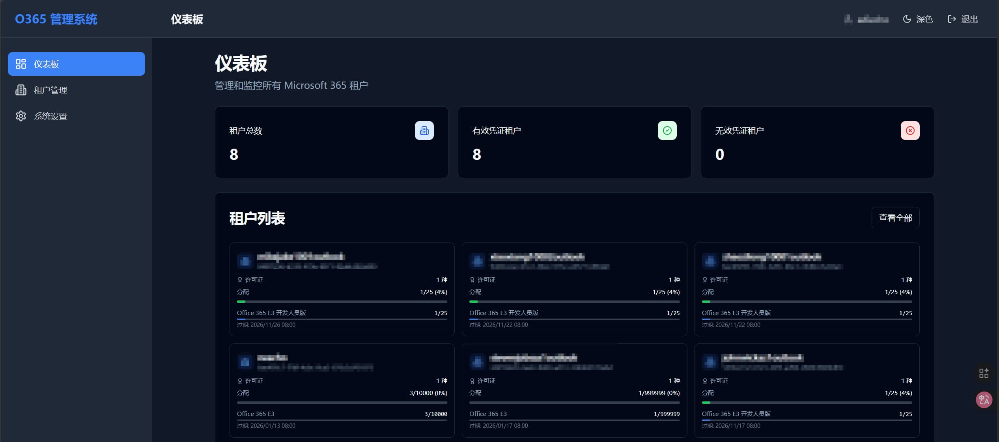
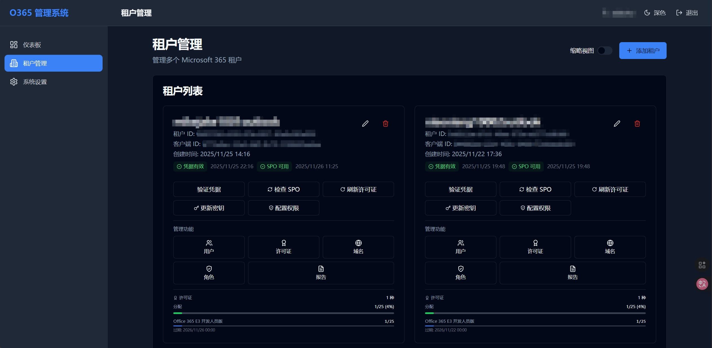
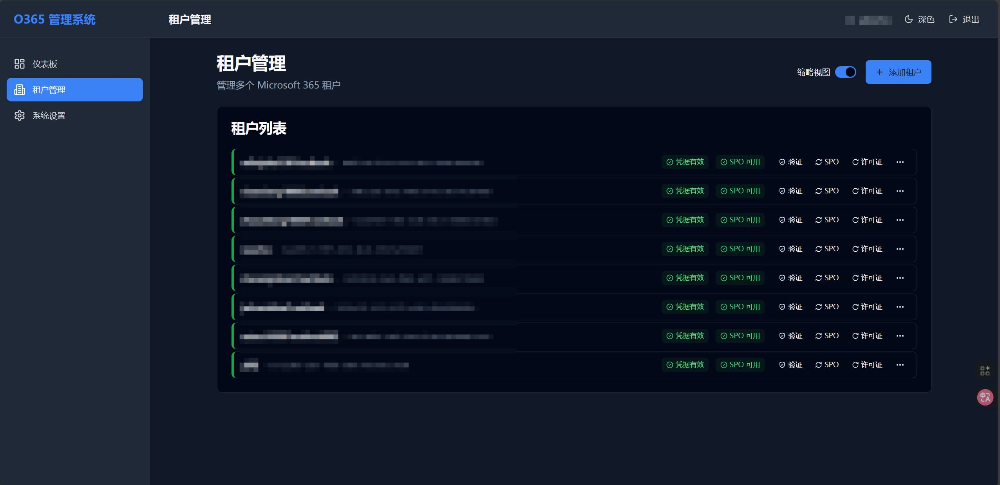
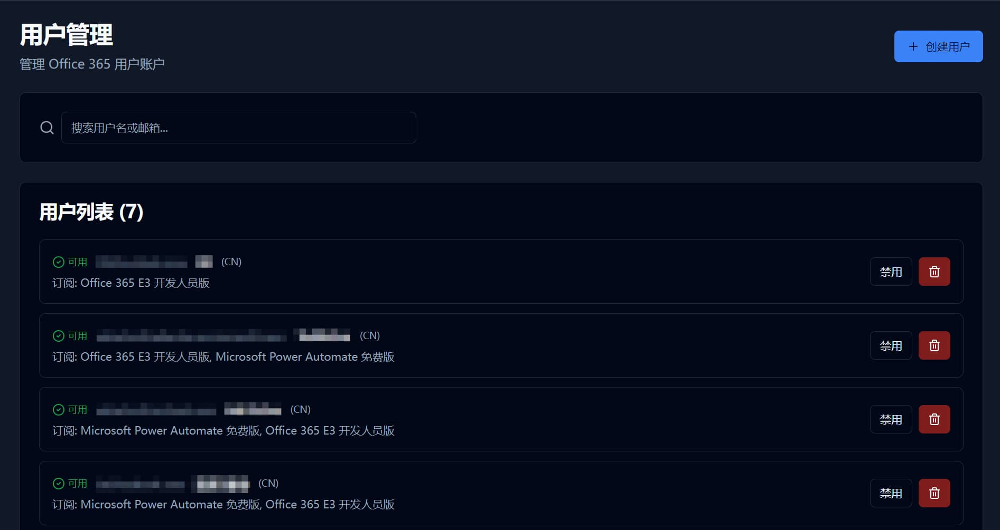
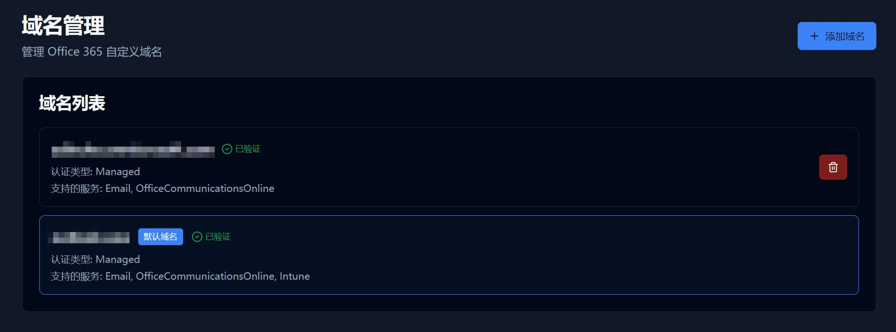

# Office 365 Multi-Tenant Manager

> 基于 FastAPI + React 的现代化异步多租户 Microsoft 365/Office 365 管理系统

[](https://www.python.org/downloads/)
[](https://fastapi.tiangolo.com/)
[](https://reactjs.org/)
[](LICENSE)

---

## 📋 目录

- [📸 截图预览](#-截图预览)
- [✨ 功能特性](#-功能特性)
- [🚀 快速开始](#-快速开始)
- [📖 使用指南](#-使用指南)
- [🔐 Azure AD 配置](#-azure-ad-配置)
- [🚢 生产部署](#-生产部署)
- [🔧 故障排除](#-故障排除)
- [📚 参考资料](#-参考资料)

---

## 📸 截图预览







---

## ✨ 功能特性

- ✅ **多租户管理** - 集中管理多个 Microsoft 365 租户
- ✅ **用户管理** - 创建、删除、启用、禁用用户，批量操作
- ✅ **许可证管理** - 查看订阅和许可证使用情况
- ✅ **域名管理** - 添加、验证、删除自定义域名
- ✅ **角色管理** - 提升/撤销全局管理员权限
- ✅ **报告生成** - OneDrive 和 Exchange 使用报告
- ✅ **权限配置** - 一键配置 API 权限
- ✅ **密钥管理** - 自动更新客户端密钥
- ✅ **现代化 UI** - 响应式设计，支持移动端

**技术栈**: FastAPI + React 18 + TypeScript + Tailwind CSS

---

## 🚀 快速开始

> **系统要求**: Python 3.10+, Node.js 16+（Docker 方式无需手动安装）

### 方法 1: Docker Compose（推荐）

```bash
# 下载配置文件
wget https://raw.githubusercontent.com/AdiEcho/o365-manager/refs/heads/master/docker-compose.yml

# 启动服务
docker-compose up -d
```

或使用已构建镜像：
```bash
docker run -d -p 8000:8000 -v $(pwd)/data:/app/data \
  -e SECRET_KEY=your-secret-key \
  --name o365-manager adiecho/o365-manager:latest
```

---

### 方法 2: 一键启动脚本

脚本会自动检测并安装依赖（Node.js 和 uv）。

```bash
# Windows
start_all.bat

# Linux/Mac
chmod +x start_all.sh && ./start_all.sh
```

---

### 方法 3: 手动安装

```bash
# 1. 安装 uv
curl -LsSf https://astral.sh/uv/install.sh | sh  # Linux/Mac
# 或 Windows: powershell -c "irm https://astral.sh/uv/install.ps1 | iex"

# 2. 克隆项目
git clone https://github.com/AdiEcho/o365-manager.git
cd o365-manager

# 3. 配置环境
cp .env.example .env  # 编辑 .env 设置 SECRET_KEY

# 4. 安装依赖并构建
uv sync
cd frontend && npm install && npm run build && cd ..

# 5. 启动服务
uv run run.py
```

---

**访问应用**: http://localhost:8000  
**健康检查**: http://localhost:8000/health

---

## 📖 使用指南

### 1. 添加租户

1. 访问 http://localhost:8000 完成初始化（创建管理员账户）
2. 点击"租户管理" → "添加租户"
3. 填写租户 ID、客户端 ID、客户端密钥
4. 点击"验证凭据"确认配置
5. 点击"配置权限"自动设置 API 权限
6. 使用生成的链接完成管理员同意授权

### 2. 功能概览

**租户管理**
- 验证凭据、更新密钥、检查 SPO 状态
- 支持紧凑/完整视图切换

**用户管理**
- 创建、删除、启用、禁用用户
- 支持批量操作

**许可证管理**
- 查看订阅和许可证使用情况
- 支持缓存和手动刷新

**域名管理**
- 添加、验证、删除自定义域名

**角色管理**
- 提升/撤销全局管理员权限

**报告生成**
- OneDrive 和 Exchange 使用报告

---

## 🔐 Azure AD 配置

### 1. 注册应用程序

1. 登录 [Azure Portal](https://portal.azure.com) → [应用注册](https://portal.azure.com/#view/Microsoft_AAD_RegisteredApps/ApplicationsListBlade)
2. 点击 **新注册**，填写：
   - 名称: Office 365 Manager
   - 账户类型: 仅此组织目录中的账户
   - 重定向 URI: 留空
3. 记录 **应用程序（客户端）ID** 和 **目录（租户）ID**

### 2. 创建客户端密钥

1. 点击 **证书和密码** → **新客户端密码**
2. 设置描述和过期时间（建议 24 个月）
3. **立即复制密钥值**（后续无法查看）

### 3. 配置 API 权限

#### 方法 A: 使用系统自动配置（推荐）

1. 手动添加 `Application.ReadWrite.All` 权限并授予管理员同意
2. 在系统中添加租户后，点击"配置权限"按钮
3. 系统自动配置所需权限，使用生成的链接完成授权

#### 方法 B: 手动配置

点击 **API 权限** → **添加权限** → **Microsoft Graph** → **应用程序权限**，添加：

**核心权限（必需）**:
- `User.ReadWrite.All` - 用户管理
- `Directory.ReadWrite.All` - 目录管理
- `Organization.Read.All` - 组织信息
- `Reports.Read.All` - 报告生成

**高级功能（推荐）**:
- `RoleManagement.ReadWrite.Directory` - 角色管理
- `Domain.ReadWrite.All` - 域名管理
- `Application.ReadWrite.All` - 应用管理和密钥更新

然后点击"授予管理员同意"

---

## 🚢 生产部署

### Docker Compose（推荐）

```bash
wget https://raw.githubusercontent.com/AdiEcho/o365-manager/refs/heads/master/docker-compose.yml
# 编辑 docker-compose.yml 设置 SECRET_KEY
docker-compose up -d
```

### Systemd 服务

创建 `/etc/systemd/system/o365-manager.service`：
```ini
[Unit]
Description=Office 365 Manager
After=network.target

[Service]
Type=simple
User=www-data
WorkingDirectory=/opt/o365-manager
ExecStart=/usr/local/bin/uv run python run.py
Restart=always

[Install]
WantedBy=multi-user.target
```

启动：`sudo systemctl enable --now o365-manager`

### Nginx 反向代理 + HTTPS

```nginx
server {
    listen 80;
    server_name your-domain.com;
    return 301 https://$server_name$request_uri;
}

server {
    listen 443 ssl http2;
    server_name your-domain.com;
    
    ssl_certificate /etc/letsencrypt/live/your-domain.com/fullchain.pem;
    ssl_certificate_key /etc/letsencrypt/live/your-domain.com/privkey.pem;

    location / {
        proxy_pass http://127.0.0.1:8000;
        proxy_set_header Host $host;
        proxy_set_header X-Real-IP $remote_addr;
        proxy_set_header X-Forwarded-For $proxy_add_x_forwarded_for;
        proxy_set_header X-Forwarded-Proto $scheme;
        proxy_connect_timeout 300;
        proxy_send_timeout 300;
        proxy_read_timeout 300;
    }
}
```

获取证书：`sudo certbot --nginx -d your-domain.com`

### 性能优化与备份

**多 Worker 进程**:
```bash
gunicorn app.main:app --workers 4 \
  --worker-class uvicorn.workers.UvicornWorker \
  --bind 0.0.0.0:8000
```

**数据库备份** (crontab):
```bash
# 每天凌晨2点备份
0 2 * * * cp /opt/o365-manager/data/o365_manager.db /backup/o365_$(date +\%Y\%m\%d).db
```

---

## 🔧 故障排除

### 常见问题

**端口被占用**
```bash
# Windows: netstat -ano | findstr :8000
# Linux/Mac: lsof -i :8000
# 解决：修改 .env 中的 API_PORT
```

**Token 获取失败**
- 检查客户端密钥是否过期
- 确认已授予管理员同意
- 确保使用"应用程序权限"而非"委托权限"
- 使用"验证凭据"按钮检查配置

**权限不足**
- 在 Azure Portal 检查 API 权限配置
- 点击"授予管理员同意"
- 等待 5-10 分钟让权限生效

**数据库锁定**
- 确保只有一个实例在运行
- 关闭其他访问数据库的进程

**Docker 相关**
```bash
# 查看日志
docker logs o365-manager
docker-compose logs -f

# 确保数据持久化
-v $(pwd)/data:/app/data
```

**更多帮助**: [GitHub Issues](https://github.com/AdiEcho/o365-manager/issues)

---

## 📚 参考资料

- [Microsoft Graph API 文档](https://docs.microsoft.com/graph/overview)
- [Microsoft Graph 权限参考](https://docs.microsoft.com/graph/permissions-reference)
- [Azure AD 应用注册指南](https://docs.microsoft.com/azure/active-directory/develop/quickstart-register-app)
- [FastAPI 文档](https://fastapi.tiangolo.com/)
- [React 文档](https://react.dev/)

## 🔒 安全建议

- 定期轮换客户端密钥（建议每 6-12 个月）
- 使用强随机 `SECRET_KEY`
- 只申请必需的 API 权限
- 启用 HTTPS 和防火墙
- 定期备份数据库

---

## 📄 许可证

本项目采用 **AGPL-3.0 License** - 详见 [LICENSE](LICENSE)

## 🤝 贡献

欢迎提交 Issue 和 Pull Request！贡献步骤：
1. Fork 本仓库
2. 创建特性分支 (`git checkout -b feature/AmazingFeature`)
3. 提交更改 (`git commit -m 'Add AmazingFeature'`)
4. 推送分支 (`git push origin feature/AmazingFeature`)
5. 提交 Pull Request

## 📧 联系

- 💬 [GitHub Issues](https://github.com/AdiEcho/o365-manager/issues)
- ⭐ 如果这个项目对你有帮助，请给个 Star！

---

<div align="center">

**Made with ❤️ for Microsoft 365 Administrators**

</div>
